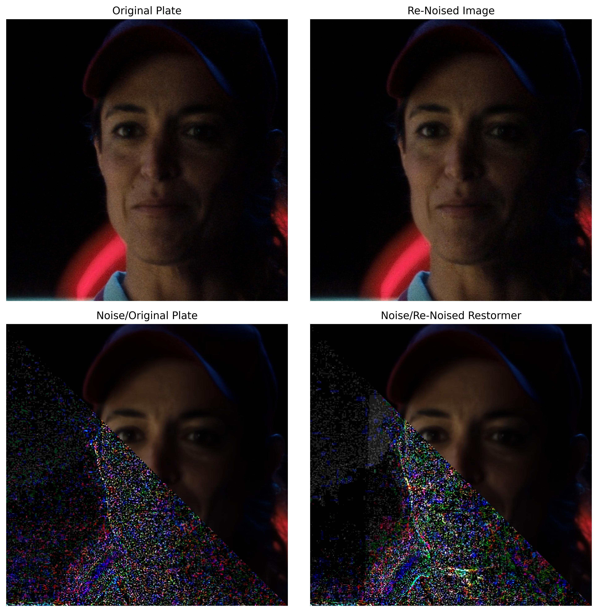

# Grain-Degrain Project

Code consisting of Grain/Degrain pipeline and analysis

## Index
+ [dasgrain](./dasgrain/) : Functions to add grain in post processing
+ [denoising](./denoising/) : Functions to denoise in pre processing 
+ [vis](./vis/) : Functions to visualize results and measure quality
+ [utils](./utils/): Experimental functions to develop codebase
+ [dl](./dl/): DL Methods for denoising
