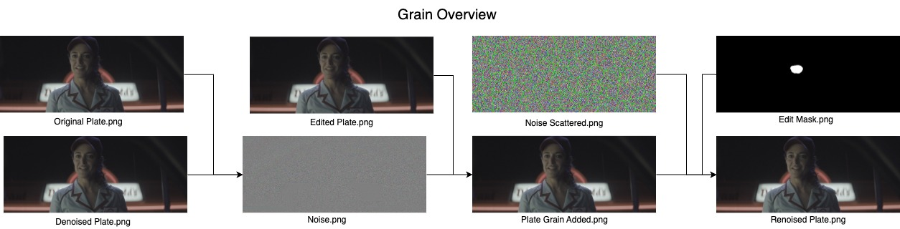

# DASGrain
This repository consists of functions necessary to apply [DASGrain](https://www.nukepedia.com/gizmos/other/dasgrain). It helps to add grain after the plate has been edited. The algorithm adds PLATE Grain to the unedited region. The noise is scattered using Voronoi Patterns and then added to the edited region. 



## Files
+ `voronoi.py` : Functions for generating vornoi patterns and scattering in different ways including swap, sampling, shuffling, etc
+ `normalize.py` : Functions for performing different steps of DASGrain.
+ `scatter_grain.py` : `Scatter_Grain` that performs scattering for 1 set of plate.
+ `dasgrain.py` : Parallel processing code for adding grains to multiple set of plates
+ `noise_transfer.py` : Function for adding custom grain on a new set of plates
+ `patch_image.py` : Functions to generate noise patterns from patches

## Run
To run DASGrain on the same set of movie plates
```
python dasgrain.py --noisy <noisy_plates_dir> \
                     --denoised <denoised_plates_dir> \
                     --edited <edited_plates_dir> \
                     --output <output_dir>/ --mask <mask_dir>
```
To run DASGrain for transfering noise from one set of plate to another
```
python noise_transfer.py --noisy_img <noisy_image> \
                        --denoised_img <denoised_image> \
                        --target_dir <target_dir> \
                        --output_dir <output_dir> 
                        --strength 5
```
