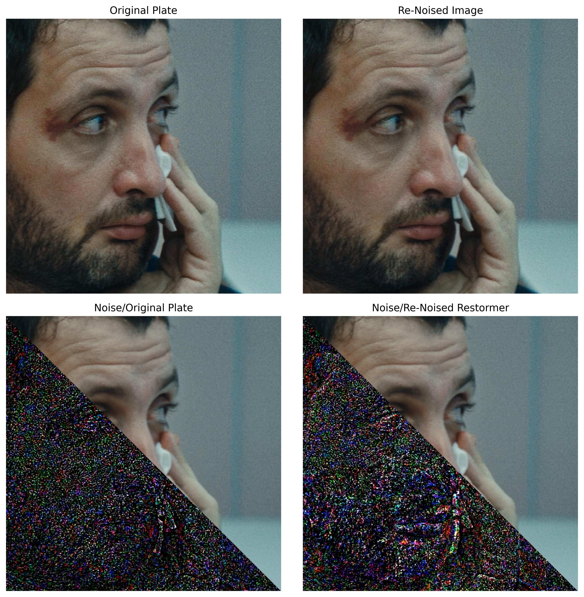

# Vis & Metrics code

This directory consists codes for visualizing and measuring metrics for various experiments

## Setup
Install mediapipe for generating face crops

## Run

Compare results with Noisy Image
```
python error.py --dir1 <noisy_dir> --dir2 <denoised_gt_dir> \
                    --dir3 <denoised_dir>

```
Compare results with Denoised GT image
```
python error_noise.py --dir1 <noisy_dir> \
                    --dir2 <denoised_gt_dir> \
                    --dir3 <denoised_dir> \
                    --output_dir <output_dir> \
                    --title "Method"
```
Compare results post renoising
```
python error_renoise.py --dir1 <noisy_dir>/ \
                            --dir2 <denoised_dir> \
                            --dir3 <renoised_dir> \
                            --output_dir <output_dir> \
                            --title "Method"
```
Compute metrics
```
python metrics_grain.py --dir1 <original_dir>  \
                    --dir2 <comparison_dir>
```